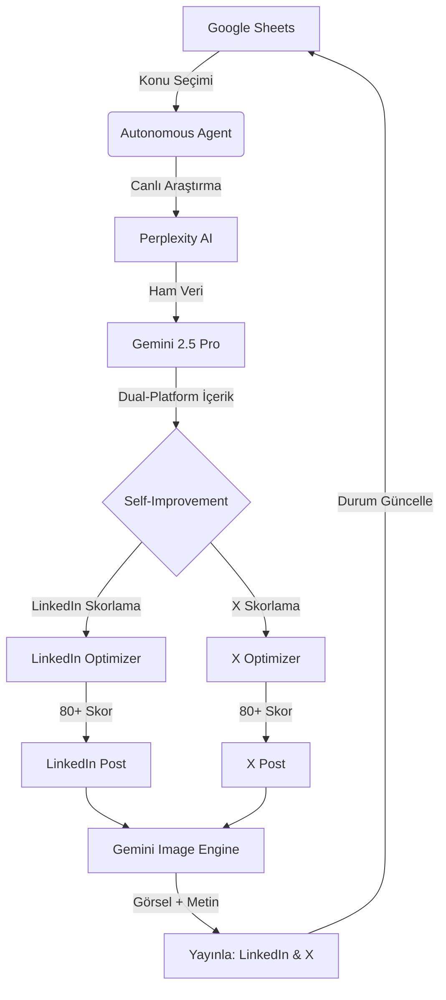

# 🤖 Botfusions Autonomous Content Engine (v2.3)

> **Precision in every byte.** LinkedIn ve X (Twitter) platformları için tasarlanmış, kendi kendini optimize edebilen (Self-Improving), tam otonom içerik üretim ve paylaşım ajanı.

---

## 🚀 Genel Bakış

Botfusions ACE, manuel müdahale gerektirmeden Google Sheets üzerinden aldığı konuları derinlemesine araştıran, platforma özel (LinkedIn & X) içerik üreten, bu içeriği sosyal medya algoritmalarına göre skorlayıp revize eden ve görselleriyle birlikte paylaşan bir otonom sistemdir. n8n gibi ara araçlara ihtiyaç duymadan doğrudan API entegrasyonlarıyla çalışır.



---

## ✨ Öne Çıkan Özellikler

-   **🧠 Dual-Agent Content Engine:** LinkedIn için kurumsal-stratejik, X için vizyoner-cyberpunk (Antigravity Persona) kimlikleriyle içerik üretimi.
-   **🔍 Live Research:** Perplexity AI ile internet üzerindeki en güncel verileri ve istatistikleri toplayarak halüsinasyon riskini minimize eder.
-   **⚖️ Self-Improving Optimizer:** İçerikleri paylaşmadan önce 14+ algoritma kuralına göre skorlar. Skor 80/100'ün altındaysa AI tarafından otomatik olarak revize edilir.
-   **🎨 AI Image Generation:** Konu ve araştırma verilerine dayalı, profesyonel infografik ve teknolojik görseller üretir.
-   **📅 Smart Scheduling:** `node-cron` ile 7/24 otonom çalışma. LinkedIn ve X için en yüksek etkileşim saatlerini hedefler.
-   **🛡️ Link Guard:** Paylaşımlarda link tespit ederse algoritma cezası almamak için linki otomatik olarak "İlk Yorum" şablonuna taşır.

---

## 🛠️ Teknik Stack

-   **Core:** Node.js (v20+), TypeScript
-   **AI Brain:** Gemini 2.5 Pro (via OpenRouter)
-   **Research:** Perplexity Sonar
-   **Database:** Google Sheets API
-   **Image:** Gemini 3.1 Flash Image Engine
-   **Automation:** Node-Cron
-   **Deployment:** Docker & Coolify

---

## 📅 Otomatik Takvim

Sistem şu anki yapılandırmasıyla günde 3 kez tetiklenir:

| Saat (TR) | Görev | Hedef Platform |
| :--- | :--- | :--- |
| **08:00** | İstanbul Detaylı Hava Durumu & Analiz | LinkedIn + X |
| **13:00** | Excel Otonom İçerik Akışı (1. Konu) | LinkedIn + X |
| **16:30** | Excel Otonom İçerik Akışı (2. Konu) | LinkedIn + X |

---

## ⚙️ Kurulum & Çalıştırma

### 1. Yerel Geliştirme

```bash
# Bağımlılıkları yükle
npm install

# Ortam değişkenlerini yapılandır
cp .env.example .env
# .env dosyasını kendi API anahtarlarınla doldur
```

> [!IMPORTANT]
> **X (Twitter) API Notu:** Paylaşım yapabilmek için X App izinlerinin **"Read and Write"** olarak ayarlanması ve Access Token'ların bu izinle yeniden oluşturulması şarttır. Aksi takdirde 403 hatası alınır.

### 2. Docker ile Dağıtım

```bash
# Container'ı arka planda başlat
docker compose up -d --build
```

---

## 📝 Son Güncellemeler (v2.3)

-   ✅ **X API v2 Entegrasyonu:** "Read and Write" izinleri doğrulanmış ve stabil hale getirildi.
-   ✅ **Hava Durumu Otomasyonu:** İstanbul için detaylı veri çekme ve görselleştirme akışı test edildi.
-   ✅ **Görsel Yükleme Fix:** X (Twitter) v1.1 media upload ve v2 tweet entegrasyonu sağlandı.
-   ✅ **Güvenlik:** API anahtarları ve servis yapılandırmaları çevre değişkenlerine (Environment Variables) taşındı.

---

## 📂 Proje Yapısı

```bash
src/
├── scheduler.ts          # 7/24 Cron motoru (Giriş noktası)
├── autonomous_agent.ts   # Ana otonom iş akışı (Orchestrator)
├── cli.ts                # Yönetim ve test araçları
└── services/
    ├── agentFlow.ts      # Ajan iş akışı mantığı
    ├── llm.ts            # Araştırma ve içerik motoru
    ├── google.ts         # Excel (Google Sheets) entegrasyonu
    ├── gemini_image.ts   # Görsel üretim motoru
    ├── imageHosting.ts   # ImgBB görsel barındırma
    ├── optimizer.ts      # LinkedIn skorlama & revize
    ├── x_optimizer.ts    # X skorlama & revize
    ├── rules.ts          # LinkedIn algoritma kuralları
    ├── x_rules.ts        # X (Twitter) algoritma kuralları
    ├── weather.ts        # Hava durumu servisi
    ├── linkedin.ts       # LinkedIn API entegrasyonu
    └── x.ts              # X (Twitter) API v2 entegrasyonu
```

---

## 📜 Lisans

© 2026 Botfusions. Tüm hakları saklıdır.
MIT Lisansı ile lisanslanmıştır.

